# doc_genai_The_usefulness_of_local_LLM
ローカルLLMの有用性について

  
## ローカルLLMの有用性について

  
### 目次
- [はじめに](#1-はじめに)
- [ローカルLLMとは](#2-ローカルllmとは)
- [クラウドの生成AIサービスとの比較](#3-クラウドの生成aiサービスとの比較)
- [ローカルLLMの実行環境と機器選定](#4-ローカルllmの実行環境と機器選定)
- [ローカルLLM導入の検討ポイント](#5-ローカルllm導入の検討ポイント)
- [具体的なユースケース例](#6-具体的なユースケース例)
- [まとめ](#7-まとめ)

  
### 1. はじめに

近年、ChatGPTをはじめとする生成AI技術の進展は目覚ましく、特に大規模言語モデル（LLM）は様々な分野で注目されています。従来、LLMはクラウドサービス上で提供されることが主流でしたが、近年ではローカル環境で動作する**ローカルLLM**が登場し、新たな選択肢として注目されています。

本資料では、ローカルLLMの概要、クラウドの生成AIサービスとの比較、導入環境の例、具体的な機器選定例などを説明し、ローカルLLM導入のメリットや検討ポイントについて解説します。

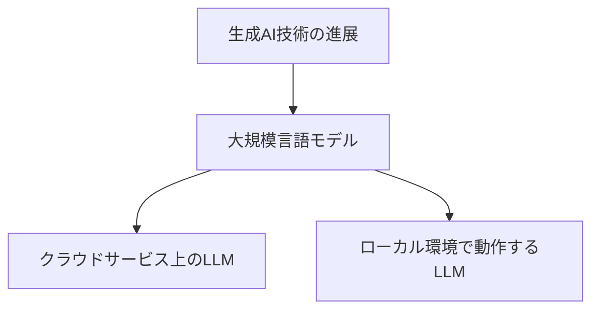
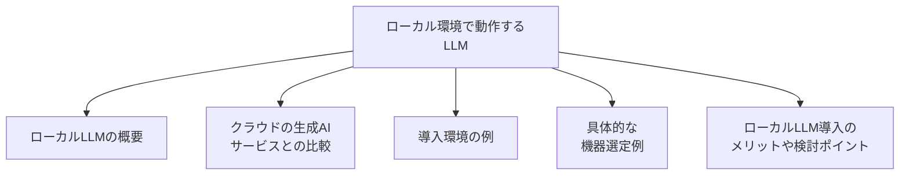

  
### 2. ローカルLLMとは

ローカルLLMとは、インターネットに接続せず、個々のデバイスやローカルネットワーク内で動作する大規模言語モデルを指します。従来のクラウドベースLLMとは異なり、ユーザーの環境内で処理を行うため、以下の利点があります。

* **データプライバシーの保護:** 機密情報を含むデータをクラウドに送信する必要がないため、データ漏洩のリスクを低減できます。
* **高速な処理:** ネットワークのレイテンシの影響を受けないため、クラウドベースLLMよりも高速な処理が可能となります。
* **オフラインでの利用:** インターネット接続がなくても利用できるため、災害時やネットワーク環境が不安定な場所でも利用できます。
* **低コスト:** クラウドサービスの利用料がかからないため、ランニングコストを削減できます。
* **カスタマイズと柔軟性:** 特定のニーズに合わせてカスタマイズできます。

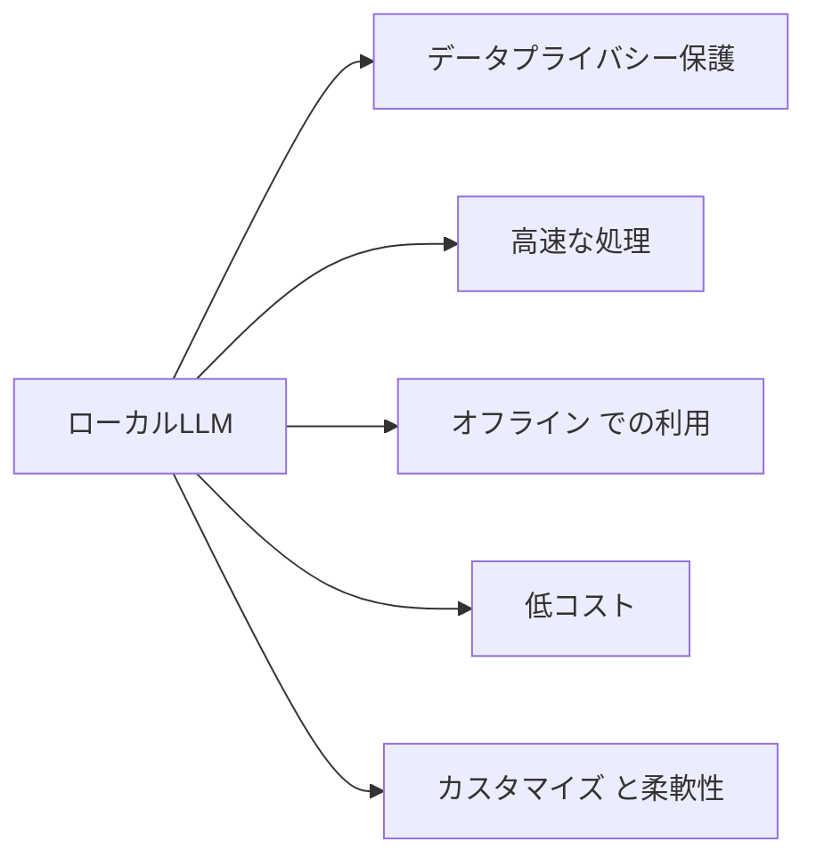

  
### 3. クラウドの生成AIサービスとの比較

| 項目           | クラウド型AIサービス | ローカルLLM |
|----------------|----------------------|--------------|
| データプライバシー | 低い                | **高い**      |
| 通信速度の影響       | 受けやすい                | **受けにくい**      |
| 回答速度       | 環境による                | 環境による      |
| 回答精度       | **高い**                | モデルによる      |
| 利用場所       | インターネット接続必須 | インターネット接続不要 |
| ランニングコスト | 高い                | **低い**      |
| スケーラビリティ | **高い**             | 低い         |
| カスタマイズ性  | 制限あり            | **高い**      |
| 機器調達       | 不要                | 必要         |

  
### 4. ローカルLLMの実行環境と機器選定

ローカルLLMを実行するには、以下の要件を満たす環境が必要です。

* **CPU/GPU:** 高性能なCPU/GPUが必要です。具体的な性能は、使用するLLMモデルのサイズや処理内容によって異なります。
* **メモリ:** 大容量のメモリが必要です。メモリ不足になると、処理速度が低下したり、エラーが発生したりする可能性があります。
* **ストレージ:** LLMモデルの保存スペースが必要です。モデルのサイズは数GBから数十GB程度です。高速なSSDの利用が推奨されます。
* **OS:** Windows、macOS、LinuxなどのOSに対応しているLLMモデルを選択する必要があります。

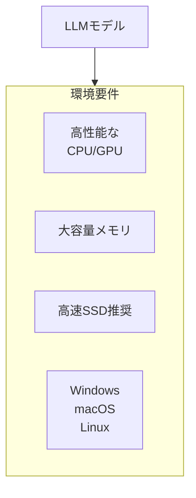

  
**具体的な機器選定例:**

* **ワークステーション:** 高性能なCPU/GPU、大容量メモリ、ストレージを備えたワークステーションは、ローカルLLMを実行するのに適しています。
* **エッジサーバー:** エッジサーバーは、現場に近い場所でのデータ処理に適しています。
* **AI専用機器:** 近年、AI処理に特化した専用機器が発売されています。高性能な処理能力と省電力性能を備えています。

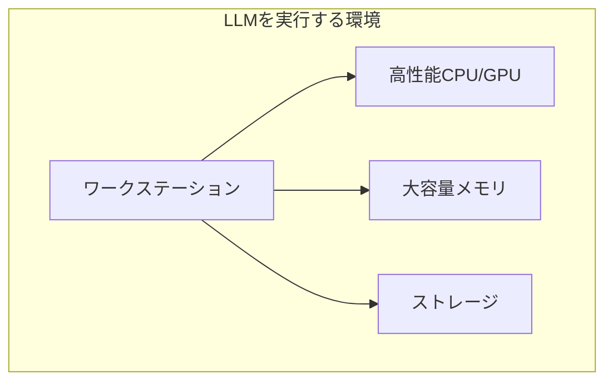
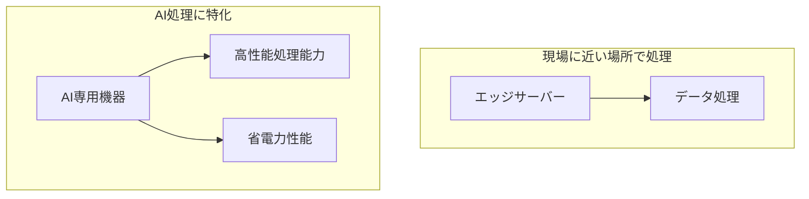

  
### 5. ローカルLLM導入の検討ポイント

ローカルLLMを導入する際には、以下の点を検討する必要があります。

* **必要な処理能力:** 使用するLLMモデルのサイズや処理内容に必要な処理能力を算出する必要があります。
* **予算:** 機器調達費用、ランニングコストなどを考慮する必要があります。
* **技術力:** ローカルLLMの導入・運用には、一定の技術力が必要です。
* **運用体制:** ローカルLLMの運用には、保守管理や更新作業などの運用体制が必要です。
* **セキュリティ対策:** ローカル環境におけるセキュリティ対策も重要となります。

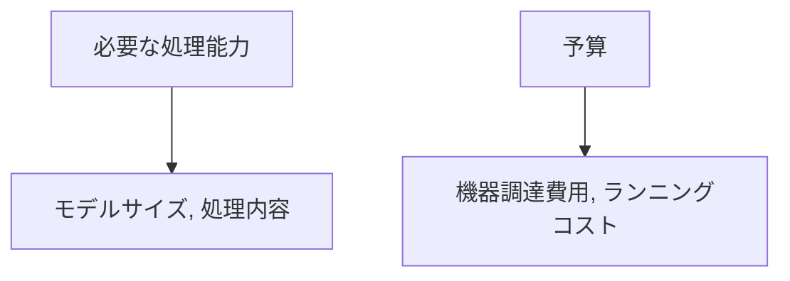
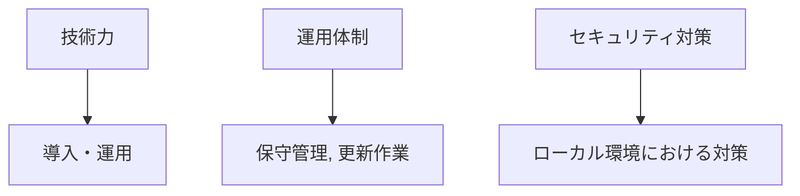

  
### 6. 具体的なユースケース例

* **社内情報検索システム:** 機密情報を含む社内文書を安全に検索・分析
* **顧客対応チャットボット:** ネットワーク接続が不安定な環境でも利用可能なチャットボット
* **コーディング支援:** プログラムの作成やコードの自動補完、バグの修正など
* **オフライン翻訳:** インターネット接続がない環境でも利用可能な翻訳システム
* **医療現場での診断支援:** 患者情報の保護を重視したAI診断支援

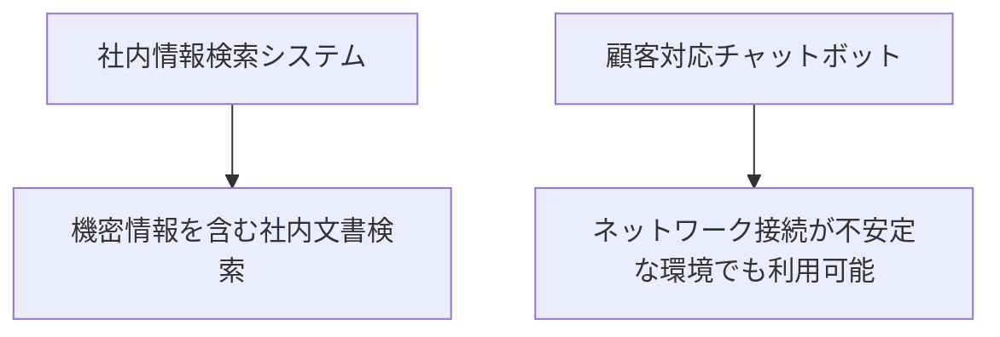
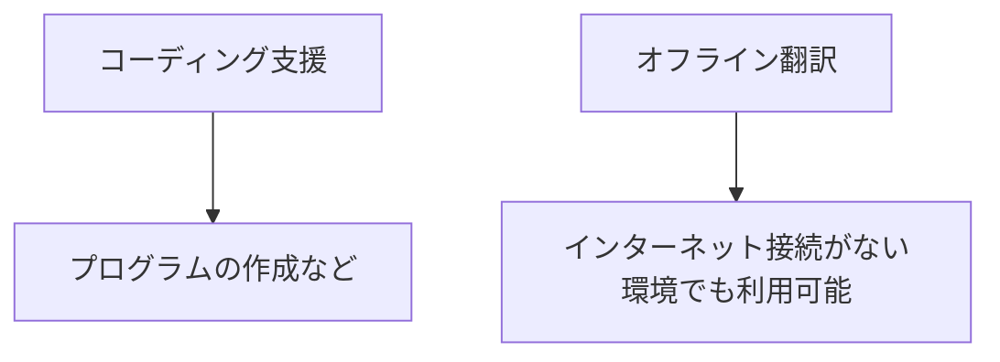
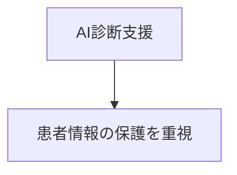

  
### 7. まとめ

ローカルLLMは、データプライバシーの保護、高速な処理、オフラインでの利用、低コストなど、多くの利点を備えています。適切な導入により、組織のAI活用を大きく前進させることができます。

今後、ローカルLLMは、エッジコンピューティングの普及や、LLMモデルの軽量化・高速化などにより、ますます注目されていくと考えられます。

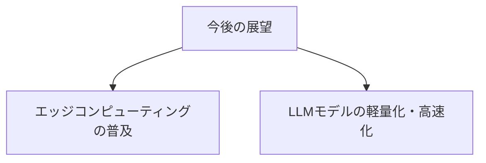

---

**補足:**

* 本資料は、ローカルLLM導入を検討する方向けに、基本的な情報をまとめたものです。
* 具体的な導入計画や運用方法については、専門業者に相談することをお勧めします。
